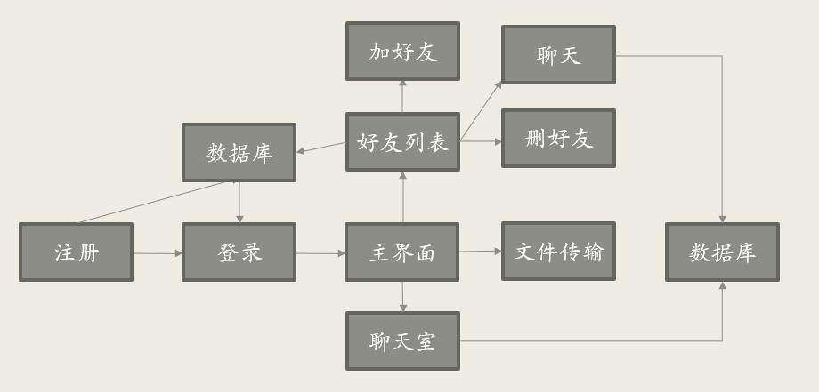
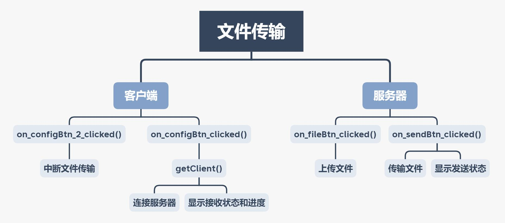
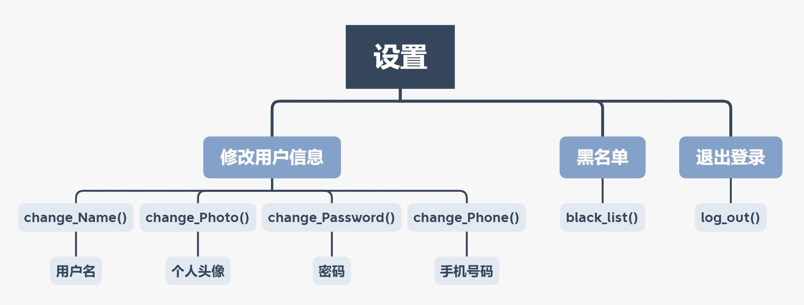
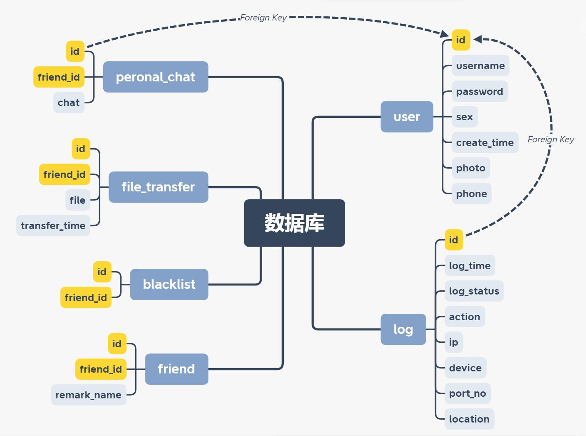
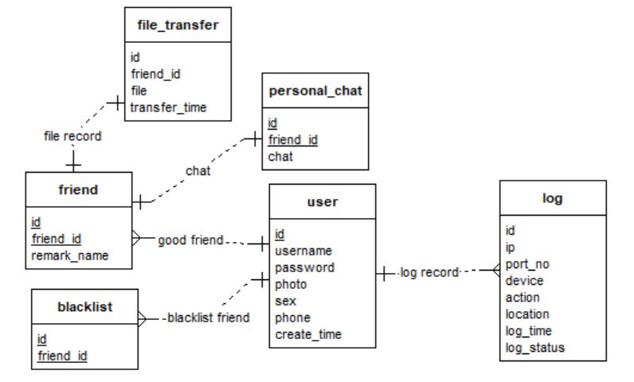

# IM-Software
 一款使用多线编程和Linux系统开发的聊天软件
 A chat software developed using Linux system and multi-threading techiques

 

### **About**

The IM instant chat system is designed to allow users to communicate quickly and easily, and realize one-to-one chat, group chat room and file transfer between users through TCP communication protocol and file transfer protocol. This project facilitates remote communication between users, allowing users in different spaces to communicate normally. The reference materials used in the project are from Neusoft Ruidao course materials and additional materials. Users can add friends, delete friends, pull friends into the blacklist, group chat rooms, etc. in the system, simulating the social status in the real society, and realize a virtual circle of friends.

 

### **Operating environment**

Hardware Environment:  VirtualBox 6.1.36 + Ubuntu 20.04.4 

Software Environment:    QT Creator 5.12.11 + GCC

 

### **Design ideas**

The IM instant chat system software we conceived has several basic functions: user one-to-one chat, chat room, adding friends, deleting friends, blocking friends, file transfer, viewing friends' dynamics, modifying users' personal information, etc. 

In the interface of file transfer, two parts of client and server are set. When the client and the server are successfully connected, the server can upload and send files; when the client accepts files, the scroll bar on the interface will display the file receiving progress, and the text parts of both parties will display the file transmission or receiving status. Users can modify personal information on the interface of the setting module, such as user name, user password, mobile phone number, personal avatar, and other operations such as logout and blacklist. 

For the construction of the database, a user table is needed to store the user's personal information, the log table is used to store the status of the user's connection to the server (that is, the login and logout status), the friend table is used to store the user's friend relationship, and the blacklist table is used to store User's blacklist, personal_chat table is used to store one-to-one chat records, and file_transfer table is used to store file transfer data.

 

### **Module structure diagram**

| Module         | **Module structure diagram**                                 |
| -------------- | ------------------------------------------------------------ |
| Overall System |  |
| File Transfer  |  |
| Settings       |  |
| Database       |  |

 

### **Database Entity Relationship diagram**

 

### **Video**

**Overall function demonstration**

https://user-images.githubusercontent.com/73232964/196332069-d4c0e313-48a8-4434-9621-0e4d76d70932.mp4

 

**Chat function demonstration**

https://user-images.githubusercontent.com/73232964/196331955-0e9cb866-d5f3-4a14-9837-80f041aa27a8.mp4

